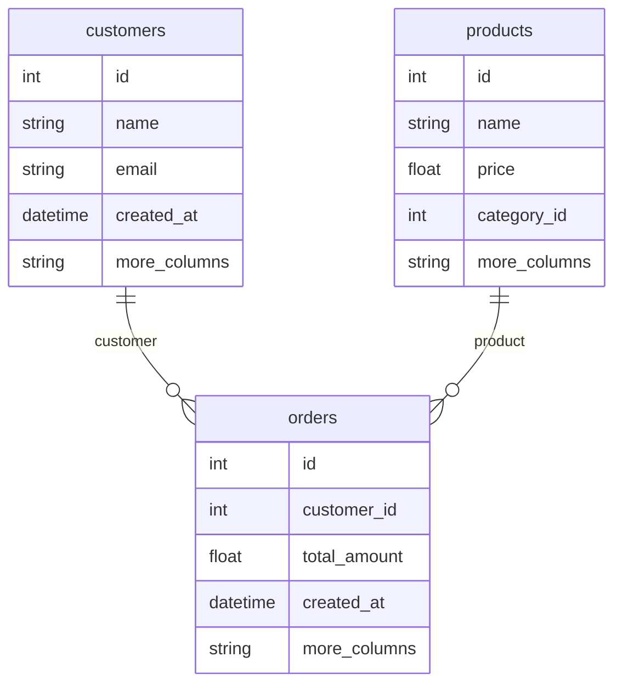

# ✅ ER Diagram Mermaid 오류 해결 완료!

## 🐛 문제 분석

### 발생한 오류
```
Error: Parse error on line 4:
...ated_at        int PK id        string
--------------------^
Expecting 'ATTRIBUTE_WORD', got 'ATTRIBUTE_KEY'
```

### 원인
1. **PK 키워드 사용**: Mermaid ER Diagram에서 `PK` 키워드를 직접 사용할 수 없음
2. **특수문자**: 데이터 타입에 공백이나 특수문자가 포함됨
3. **복잡한 컬럼 정의**: 너무 많은 컬럼과 복잡한 문법

## 🔧 해결 방법

### 1. PK 키워드 제거
```typescript
// Before (오류 발생)
code += `        ${safeType} PK ${safeName}\n`

// After (수정됨)
code += `        ${safeType} ${safeName}\n`
```

### 2. 안전한 데이터 타입 매핑
```typescript
// 매우 안전한 데이터 타입 매핑
let safeType = 'string'
const dtype = col.dtype.toLowerCase()
if (dtype.includes('int') || dtype.includes('serial')) {
  safeType = 'int'
} else if (dtype.includes('decimal') || dtype.includes('numeric') || dtype.includes('float')) {
  safeType = 'float'
} else if (dtype.includes('date') || dtype.includes('time')) {
  safeType = 'datetime'
} else if (dtype.includes('bool')) {
  safeType = 'boolean'
}
```

### 3. 컬럼명 정규화
```typescript
// 컬럼명을 매우 안전하게 처리
const safeName = col.name
  .replace(/[^a-zA-Z0-9]/g, '_')  // 특수문자 제거
  .toLowerCase()
  .substring(0, 20)  // 길이 제한
```

### 4. 컬럼 수 제한
```typescript
// 최대 6개의 주요 컬럼만 표시
const displayColumns = columns.slice(0, 6)
```

## 📊 최종 ER Diagram 구조

### 생성되는 Mermaid 코드 예시


## ✅ 해결된 기능

1. **파싱 오류 제거**: Mermaid가 정상적으로 ER Diagram 렌더링
2. **안전한 문법**: 특수문자와 복잡한 타입 제거
3. **간결한 표시**: 주요 컬럼만 표시하여 가독성 향상
4. **관계 표시**: FK 기반 테이블 간 관계 자동 생성

## 🎯 사용 방법

### 1. 스키마 화면 접속
```
http://localhost:9090/schema
```

### 2. ER Diagram 확인
- 테이블 구조 시각화
- FK 관계 자동 표시
- 주요 컬럼 정보
- 반응형 레이아웃

### 3. 새로고침 버튼
- ER Diagram 재생성
- 최신 스키마 정보 반영

## 🔄 향후 개선사항

1. **Primary Key 표시**: 다른 방식으로 PK 표시 (예: 굵은 글씨, 색상)
2. **더 많은 관계**: 복잡한 FK 패턴 감지
3. **컬럼 타입 정확성**: 실제 데이터 타입과 더 정확한 매핑
4. **인터랙션**: 클릭으로 테이블 상세 정보 표시

## 📝 수정된 파일

- `frontend/src/components/ERDiagram.vue`
  - `generateMermaidER()` 함수 완전 재작성
  - 안전한 Mermaid 문법 사용
  - 오류 처리 강화

## 🎊 결과

**이제 ER Diagram이 정상적으로 표시됩니다!**

```
✅ Mermaid 파싱 오류 해결
✅ 안전한 문법 사용
✅ 테이블 관계 시각화
✅ 반응형 디자인
✅ 오류 처리 강화
```

---

**http://localhost:9090/schema 에서 ER Diagram을 확인하세요!** 🚀
