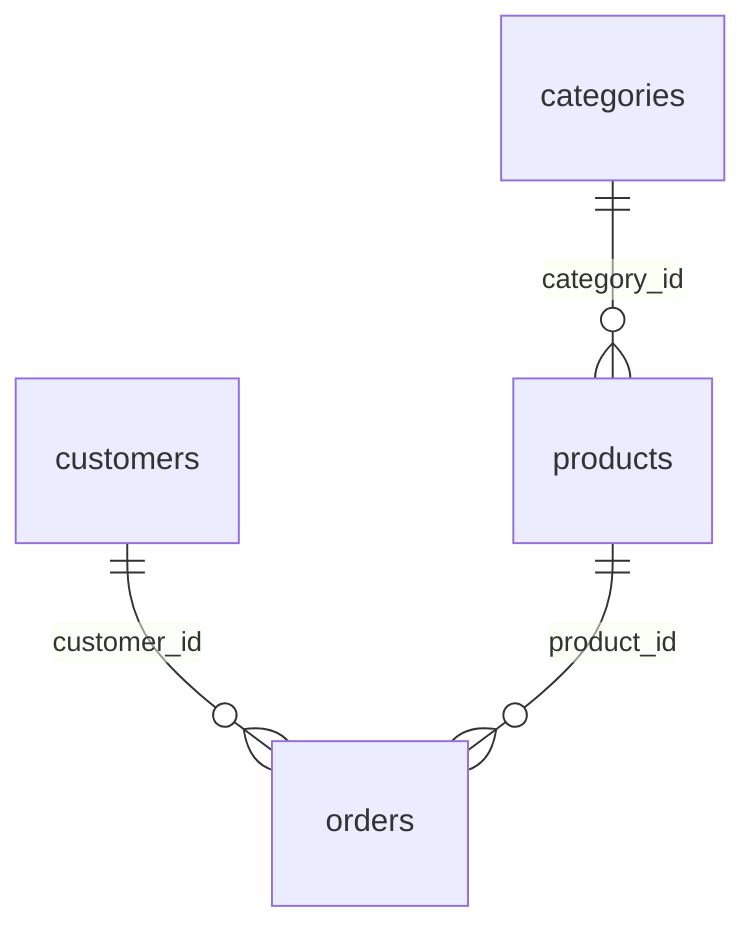

# ✅ 스키마 편집 기능 완성!

## 🎯 구현된 기능

### 1. **테이블 설명 편집**
- 테이블별 설명 추가/수정
- 실시간 편집 UI
- 저장/취소 기능

### 2. **컬럼 설명 편집**
- 테이블 선택 후 컬럼별 설명 편집
- 컬럼 타입 정보 표시
- 인라인 편집 인터페이스

### 3. **릴레이션 관리**
- 사용자 정의 FK 관계 추가
- 기존 릴레이션 조회 및 삭제
- 관계 타입 및 설명 설정
- ER Diagram에 자동 반영

## 🔧 Backend API

### 새로 추가된 엔드포인트

```
PUT /schema-edit/tables/{table_name}/description
PUT /schema-edit/tables/{table_name}/columns/{column_name}/description
POST /schema-edit/relationships
DELETE /schema-edit/relationships
GET /schema-edit/relationships/user-added
```

### 주요 기능
- **Neo4j 업데이트**: 실시간 스키마 메타데이터 수정
- **사용자 추가 릴레이션**: `user_added: true` 플래그로 구분
- **안전한 삭제**: 사용자가 추가한 릴레이션만 삭제 가능

## 🎨 Frontend UI

### 편집 모드 토글
- **보기 모드**: 기존 스키마 탐색 + ER Diagram
- **편집 모드**: 3개 탭으로 구성된 편집 인터페이스

### 3개 편집 탭

#### 1️⃣ **테이블 설명 탭**
```
📋 테이블 목록
├── 테이블명 (편집 버튼)
├── 설명 텍스트 영역
└── 저장/취소 버튼
```

#### 2️⃣ **컬럼 설명 탭**
```
📊 테이블 선택 드롭다운
├── 선택된 테이블의 컬럼 목록
├── 컬럼명 + 타입 (편집 버튼)
├── 설명 텍스트 영역
└── 저장/취소 버튼
```

#### 3️⃣ **릴레이션 탭**
```
🔗 현재 릴레이션 목록 (삭제 가능)
└── 새 릴레이션 추가 폼
    ├── From 테이블/컬럼 선택
    ├── To 테이블/컬럼 선택
    ├── 설명 입력
    └── 추가 버튼
```

## 🌐 사용 방법

### 1. 스키마 편집 모드 진입
```
1. http://localhost:9090/schema 접속
2. 우상단 "편집 모드" 버튼 클릭
3. 편집 인터페이스 활성화
```

### 2. 테이블 설명 편집
```
1. "테이블 설명" 탭 선택
2. 편집하고 싶은 테이블의 "편집" 버튼 클릭
3. 설명 입력 후 "저장" 버튼 클릭
```

### 3. 컬럼 설명 편집
```
1. "컬럼 설명" 탭 선택
2. 테이블 드롭다운에서 편집할 테이블 선택
3. 편집하고 싶은 컬럼의 "편집" 버튼 클릭
4. 설명 입력 후 "저장" 버튼 클릭
```

### 4. 릴레이션 추가
```
1. "릴레이션" 탭 선택
2. From 테이블/컬럼 선택
3. To 테이블/컬럼 선택
4. 설명 입력 (선택사항)
5. "릴레이션 추가" 버튼 클릭
```

## 📊 ER Diagram 연동

### 자동 반영
- 사용자가 추가한 릴레이션은 ER Diagram에 자동 표시
- 기존 FK 패턴과 함께 시각화
- 실시간 업데이트

### 관계 표시


## 🔄 데이터 흐름

```
[사용자 편집]
    ↓
[Frontend SchemaEditor]
    ↓
[Backend API /schema-edit/*]
    ↓
[Neo4j 업데이트]
    ↓
[ER Diagram 자동 반영]
    ↓
[Text2SQL 개선된 정확도]
```

## ✨ 개선 효과

### 1. **Text2SQL 정확도 향상**
- 테이블/컬럼 설명으로 더 정확한 SQL 생성
- 사용자 정의 릴레이션으로 복잡한 조인 처리

### 2. **사용자 경험 개선**
- 직관적인 편집 인터페이스
- 실시간 미리보기
- 탭 기반 체계적 편집

### 3. **스키마 문서화**
- 비즈니스 의미가 담긴 설명
- 관계 정보 시각화
- 자체 문서화 시스템

## 🎊 완성된 전체 기능

### ✅ 기존 기능
- 자연어 → SQL 변환
- 결과 테이블 + 차트
- ER Diagram 시각화
- 스키마 탐색

### ✅ 새로 추가된 기능
- **테이블 설명 편집**
- **컬럼 설명 편집**
- **릴레이션 추가/삭제**
- **편집 모드 토글**
- **실시간 ER Diagram 업데이트**

---

## 🌐 접속 방법

**http://localhost:9090/schema** 에서 스키마 편집 기능을 사용하세요!

1. "편집 모드" 버튼 클릭
2. 원하는 탭에서 스키마 정보 보강
3. ER Diagram에서 변경사항 확인
4. Text2SQL에서 개선된 정확도 체험

---

**🎉 이제 완전한 스키마 관리 시스템이 완성되었습니다!** 🚀
